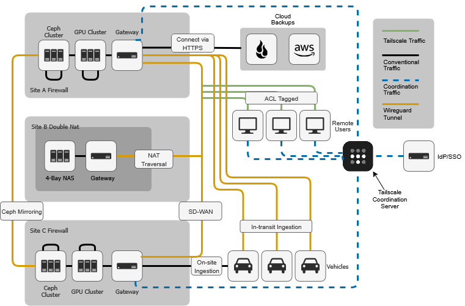

## Summary
This proposal represents a design based on the information available and my knowledge of modern, effective technologies. It would be further refined after a more in-depth discovery and analysis.

This network design creates a secure, scalable, and performant system using a hybrid connectivity. A Software-Defined Wide-Area Network manages inter-site traffic, and remote user access is handled with a **Tailscale-based zero-trust mesh network**, allowing finer, identity-based control over resources. A tiered strategy handles the >15 TB of daily data from test vehicles, which connect via a dedicated **WireGuard tunnel**. Data is stored on a scalable Ceph cluster with tiered cloud backups managed by a **Backup Scheduler**. A **Site Manager** provides centralized, secure Wi-Fi across all sites with a single SSID.

---

## Scope & Requirements
The network design must meet the following criteria:

* **Reliable, secure connectivity** between all sites and for remote users.
* **Ability to upload large test vehicle data** (>15 TB/day) to an expandable storage cluster.
* **Data backup** for some stored data.
* **Seamless, secure Wi-Fi** at all sites.
* A balance of **security, performance, and usability**.
* Use of **commonly available technologies** (commercial or open-source).

---

## Assumptions
* **Identity Management:** The company has a centralized Identity Provider (IdP), such as Microsoft Entra ID or Google Workspace, for managing user and device identities. This IdP will be used for authentication and authorization.
* **Operational Budget:** There is a sufficient budget for the proposed commercial and open-source technologies, including licensing for a managed VPN service (Tailscale) and the purchase of networking hardware.
* **Bandwidth:** The provided bandwidth numbers (100 Gbps at Site A, 1 Gbps at Site B, and 5 Gbps at Site C) are assumed to be consistent and reliable. Cellular coverage for test vehicles is assumed to be intermittent, so data will be uploaded in batches.
* **Data Characteristics:** The >15 TB of data is primarily raw, unprocessed data that can be compressed to reduce transfer times.
* **Vehicles:** Test vehicles have large, redundant, removable storage drives, making "pack and ship" a viable and secure last-resort solution.

---

## High-Level Design

---

## Detailed Design

### Inter-Site Connectivity: SD-WAN
* **Technology Selection:** The recommended solution is a **Software-Defined Wide Area Network (SD-WAN)**. This approach creates a unified, centrally managed network over existing internet connections. Many vendors provide SD-WAN solutions, each catering to different needs. For instance, vendors like Ubiquiti offer powerful prosumer and small to medium business solutions, while vendors like Cisco provide large-scale enterprise-grade options. The ultimate choice of vendor would depend on a more detailed analysis of the company's specific needs, including budget, required support levels, and advanced feature requirements.

* **Justification:** For site-to-site connectivity, an SD-WAN provides a simple, reliable, and centrally managed solution. This technology automatically handles complex networking challenges, such as the double-NAT at Site B, creating a private network over the public internet.

* **Implementation:**
    * An SD-WAN gateway from the chosen vendor will be deployed at each of the three sites (A, B, and C).
    * The platform's central controller is then used to automatically build a secure, full-mesh overlay network connecting all sites.
    * This allows any device on the local network of one site to communicate directly with devices at another site without complex manual configuration.

**Remote and Mobile Connectivity:** Layered VPN Access

A layered approach is used for remote access to apply the right tool for each specific use case.

* **Remote Users (Tailscale Zero Trust):** Work-from-home employees will use the Tailscale client on their workstations. This creates a separate, identity-aware overlay network. Access to internal resources is controlled by Access Control Lists (ACLs). Tailscale will be installed as a subnet router at Sites A and C, allowing authenticated users to securely access local LAN resources.

* **Test Vehicles (Dedicated WireGuard Tunnel):** For maximum performance and simplicity, each vehicle's workstation will establish a direct WireGuard tunnel to the gateway at Site A. This provides a lightweight, high-speed, and secure channel optimized for bulk data transfer from a mobile environment.

### Data Ingestion: Handling High-Volume Transfers
* **Technology Selection:** A hybrid approach combining direct high-bandwidth transfers, automated secure protocols, and physical media shipping.
* **Justification:** A single solution cannot handle the diverse scenarios for data ingestion. So, we use a multi-layered approach.
* **Implementation:**
    * **On-site Ingestion:** When a vehicle returns to a site, data is transferred via a high-speed link (e.g., 10 Gbps Ethernet) directly to the local storage cluster.
    * **In-transit Ingestion:** For vehicles that don't return daily, a high-bandwidth file transfer software will transfer data in batches over the dedicated WireGuard VPN tunnel. This software should be configured to compress data, automatically resume transfers after any network interruptions, and verify data integrity.
    * **Physical Media Backup:** As a failover, physical drives can be securely packed and shipped to Site A for ingestion.

### Storage and Backup: Scalable and Resilient Data Management
* **Technology Selection:** **Ceph** for primary storage and a tiered cloud backup strategy using **Backblaze** and **AWS storage classes**.
* **Justification:** Ceph provides a distributed, scalable, and fault-tolerant storage solution. A managed backup platform would simplify the process of managing backup jobs. The tiered cloud strategy optimizes cost and redundancy.
* **Implementation:**
    * **Primary Storage:** A Ceph cluster will be deployed at Site A, with a secondary cluster at Site C. The clusters will be configured to replicate data asynchronously using Ceph's mirroring feature.
    * **Data Backup:** A server running backup jobs will be deployed at Site A:
        * **Hot data:** Backed up to Backblaze B2 for fast, low-cost access.
        * **Warm data:** AWS S3 Standard-Infrequent Access for less frequent access.
        * **Cold data:** AWS Glacier Storage for long-term, low-cost archival.

### On-Premise Networking: Secure Wireless Access
* **Technology Selection:** **Site Manager** ecosystem for centralized management (e.g., UniFi Site Manager or Cisco SD-Access).
* **Justification:** A Site Manager allows for centralized management of all access points across multiple sites from a single controller, simplifying administration and providing a unified SSID for a seamless user experience.
* **Implementation:**
    * A Site Manager controller will be deployed on-premise or in the cloud.
    * A single, unified SSID (e.g., "Corp-WiFi") will be configured across all sites.
    * A separate, isolated guest Wi-Fi network will be created.
    * The network will be logically segmented using **VLANs** and IPv4 subnetting to isolate traffic and enhance security.

---

## Security
The network's security is founded on a **Zero Trust Architecture (ZTA)**, which operates on the principle of "never trust, always verify."

* **Principle of Least Privilege:** Access to resources is limited to the minimum level of permission required, enforced by Tailscale ACLs.
* **Strong Authentication and Authorization:**  Every user and device connecting remotely must be authenticated via the company's IdP, with Multi-Factor Authentication (MFA) enforced.
* **Segmentation:** The use of VLANs and subnets creates smaller, isolated network segments, limiting the spread of a security breach and improving performance.
